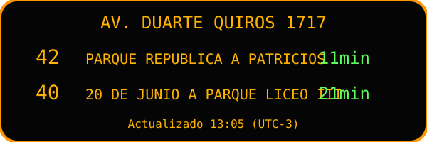

# Córdoba Transit Tracker

## ¿Qué es este proyecto?
Este repositorio implementa un tablero web inspirado en el proyecto [Transit Tracker](https://transit-tracker.eastsideurbanism.org/) para mostrar los próximos arribos de los colectivos 40, 42 y 71 en la parada **AV. DUARTE QUIROS 1717-1728 (A911)** de Córdoba Capital. El objetivo es ofrecer un MVP listo para desplegar que reutiliza el cliente oficial de Tu Bondi (`TuBondi.ApiClient`) y mantiene toda la lógica en el servidor (ningún navegador llama a la API municipal).

## ¿Cómo funciona (de punta a punta)?
La solución sigue arquitectura limpia (Domain → Application → Infrastructure → Presentation) y mantiene la sesión `PHPSESSID` en el backend. El flujo completo es:

```
┌─────────┐   consulta Query   ┌────────────┐   llama a API   ┌──────────────┐
│ WebApp  │ ─────────────────▶ │ Application│ ───────────────▶│ ITuBondiClient│
└─────────┘   GetArrivals      │ (Use case) │   (Polly +      └──────────────┘
      ▲                        └────────────┘   caché 15s)           │
      │                 ▲            │                           Tu Bondi
      │        JSON     │            ▼                              (conf=cbaciudad)
      │    `/api/arrivals`     ┌────────────┐
      │    + headers (stop,    │ Domain DTO │ ◀── `api-examples/*.json`
      │    notificaciones)     └────────────┘
      │                              │
      │    JS LedBoard actualiza      ▼
      └────────────── HTML/CSS ──▶ LED board responsive con reloj UTC-3
```

1. `TuBondi.Presentation.WebApi` expone `/api/arrivals`. El frontend solo consulta este endpoint.
2. El caso de uso `GetArrivalsForBoardQuery` aplica filtros y ordena por ETA.
3. `TuBondiGateway` (Infrastructure) usa `ITuBondiClient`, administra la cookie y aplica Polly (retry + circuit breaker) con caché de 10–15 s.
4. El resultado normalizado llega al componente `<led-board>` que se renderiza con CSS grid estilo LED y un reloj UTC-3.
5. Si la API envía `notificacion`, el servidor agrega un header para que el frontend muestre una fila de alerta intermitente.

## Requisitos previos
- .NET SDK 10 (o el SDK preview disponible) para compilar los cuatro proyectos.
- Docker 24+ si se desea ejecutar contenedores.
- Acceso a Internet para comunicarse con `https://micronauta4.dnsalias.net`.
- Variables de entorno soportadas (todas pueden sobreescribirse):
  - `TuBondi__BaseUrl`, `TuBondi__Conf`, `TuBondi__CacheDurationSeconds`
  - `Tracker__StopCode`, `Tracker__Lines`, `Tracker__UpdateIntervalSeconds`

## Instalación y ejecución local (paso a paso)
1. Clonar el repo y posicionarse en la raíz:
   ```bash
   git clone https://github.com/<tu-usuario>/Tu-Bondi-Tracker.git
   cd Tu-Bondi-Tracker
   ```
2. Restaurar dependencias y compilar toda la solución:
   ```bash
   dotnet build TuBondi.sln
   ```
3. Ejecutar el Web API (usa `appsettings.json` por defecto):
   ```bash
   dotnet run --project src/TuBondi.Presentation.WebApi/TuBondi.Presentation.WebApi.csproj
   ```
4. Abrir `http://localhost:8080` en un navegador moderno. Verás el tablero LED con la parada A911.
5. Verificar el endpoint de datos en otra pestaña:
   ```bash
   curl http://localhost:8080/api/arrivals?lines=40,42,71
   ```
   La respuesta es una lista JSON con `line`, `etaMinutes`, `distanceKm`, `route`, `direction`, `operator`, `color`, `notification` y `rawMessage`.

## Configuración
`src/TuBondi.Presentation.WebApi/appsettings.json` contiene tres bloques:
- `TuBondi`: `BaseUrl`, `Conf` y `CacheDurationSeconds` para el adaptador.
- `Tracker`: `StopCode`, `StopDescription`, `Lines` y `UpdateIntervalSeconds` (25 s por defecto).
- `Logging`: niveles de log.

Para cambiar la parada o las líneas, actualiza el bloque `Tracker` o exporta variables:
```bash
export Tracker__StopCode=A123
export Tracker__Lines="20,21"
export Tracker__UpdateIntervalSeconds=20
```
Las mismas variables funcionan dentro de Docker Compose.

## Uso del tablero
- Fila superior: nombre de la parada y botón de alto contraste (invierte los colores para ambientes luminosos).
- Fila central: lista rotativa de arribos (máximo 6) ordenados por ETA. Cada fila muestra línea, destino/sentido, distancia y minutos restantes. Si hay alertas, se agregan filas verdes intermitentes.
- Fila inferior: reloj en UTC-3 más el texto “Actualizado HH:MM”.
- Auto refresco: el script `wwwroot/js/board.js` hace `fetch` cada 25 s y actualiza el DOM con animaciones suaves (`requestAnimationFrame`).
- Manejo de errores: si la API falla, el estado muestra “Error consultando la API” y se conserva el último dato válido.

## Docker
1. Construir la imagen local:
   ```bash
   docker build -t cordoba-transit-tracker .
   ```
2. Ejecutar con docker-compose (incluye todas las variables necesarias y expone el puerto 8080):
   ```bash
   docker-compose up --build
   ```
3. Revisar logs en vivo:
   ```bash
   docker logs -f <container-id>
   ```

## Pruebas
El proyecto usa xUnit + FluentAssertions. Para correr todos los tests:
```bash
dotnet test TuBondi.sln
```
Cobertura principal:
- Mapeo de `/api-examples/06-arrivals.json` a `TransitArrival`.
- Filtrado/ordenamiento por líneas con tope de seis entradas.
- Reintento automático cuando se pierde la cookie `PHPSESSID`.
- Cálculo del intervalo de refresco y TTL del caché de memoria.
- Verificación de que `TuBondi.Application` no referencia `TuBondi.ApiClient`.
- Registro DI que resuelve `ITransitDataSource` → `TuBondiGateway` con `ITuBondiClient` real.

## Buenas prácticas y límites
- **Etiqueta**: identifica tu integración con un User-Agent propio (ver `AddTuBondiApiClient`).
- **Caching**: el TTL de 10–15 s evita sobrecargar los endpoints municipales.
- **Rate limiting**: Polly agrega backoff exponencial con jitter; evita ejecutar múltiples instancias sin control.
- **Privacidad**: la cookie `PHPSESSID` vive solo en el servidor (IMemoryCache). No se expone al cliente web.
- **Seguridad**: usa HTTPS siempre (`https://micronauta4.dnsalias.net`).

## Capturas y demo
- SVG de referencia (`docs/led-board.svg`):
  
- Inspiración oficial: [https://transit-tracker.eastsideurbanism.org/docs/build-guide/materials](https://transit-tracker.eastsideurbanism.org/docs/build-guide/materials)

## Preguntas Frecuentes (FAQ)
**No se muestra nada en el tablero**
- Verifica que `/api/arrivals` responda (usa `curl`). Si falla, revisa logs para detectar cortes de TuBondi.

**¿Cómo agrego otra línea o parada?**
- Cambia `Tracker__Lines` y `Tracker__StopCode` via `appsettings.json` o variables de entorno. Reinicia el servicio.

**¿Problemas con la cookie / sesión?**
- El adaptador detecta `InvalidOperationException` y vuelve a ejecutar `InitializeSessionAsync`. Aun así, si el host bloquea tu IP, espera antes de reintentar.

**¿Puedo usar otro frontend?**
- Sí. Consuma `/api/arrivals` (lista JSON) y lea los headers `X-Stop-Description`, `X-Board-GeneratedAt` y `X-Board-Notifications`.

## Créditos y referencias
- Transit Tracker: [https://transit-tracker.eastsideurbanism.org/](https://transit-tracker.eastsideurbanism.org/)
- Build guide: [https://transit-tracker.eastsideurbanism.org/docs/build-guide](https://transit-tracker.eastsideurbanism.org/docs/build-guide)
- Materials: [https://transit-tracker.eastsideurbanism.org/docs/build-guide/materials](https://transit-tracker.eastsideurbanism.org/docs/build-guide/materials)
- Wire displays: [https://transit-tracker.eastsideurbanism.org/docs/build-guide/wire-displays](https://transit-tracker.eastsideurbanism.org/docs/build-guide/wire-displays)
- Flash & configure: [https://transit-tracker.eastsideurbanism.org/docs/build-guide/flash-and-configure](https://transit-tracker.eastsideurbanism.org/docs/build-guide/flash-and-configure)
- Print frame: [https://transit-tracker.eastsideurbanism.org/docs/build-guide/print-frame](https://transit-tracker.eastsideurbanism.org/docs/build-guide/print-frame)
- Assemble frame: [https://transit-tracker.eastsideurbanism.org/docs/build-guide/assemble-frame](https://transit-tracker.eastsideurbanism.org/docs/build-guide/assemble-frame)
- Upstream repo: [https://github.com/EastsideUrbanism/transit-tracker](https://github.com/EastsideUrbanism/transit-tracker)
- Fuente de datos Tu Bondi: [https://micronauta4.dnsalias.net/web/urbano/?conf=cbaciudad](https://micronauta4.dnsalias.net/web/urbano/?conf=cbaciudad)

## Licencia
MIT. Consulta `LICENSE` para más detalles.
